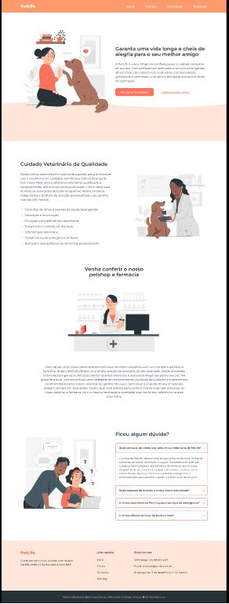

# Projeto1-PetLife
Esse é meu primeiro projeto de desenvilvimento web, fiz um site fictício de um petshop, estou estudando mais para poder me aprimorar, pois ainda estou apenas no basico, nesse site usei HTML, CSS e JavaScript.!

Usei JavaScript para interagir com o usuraio nas duvidas, onde o usuario clica e consegue vizualizar as respostas no qual ele tem duvidas.!
